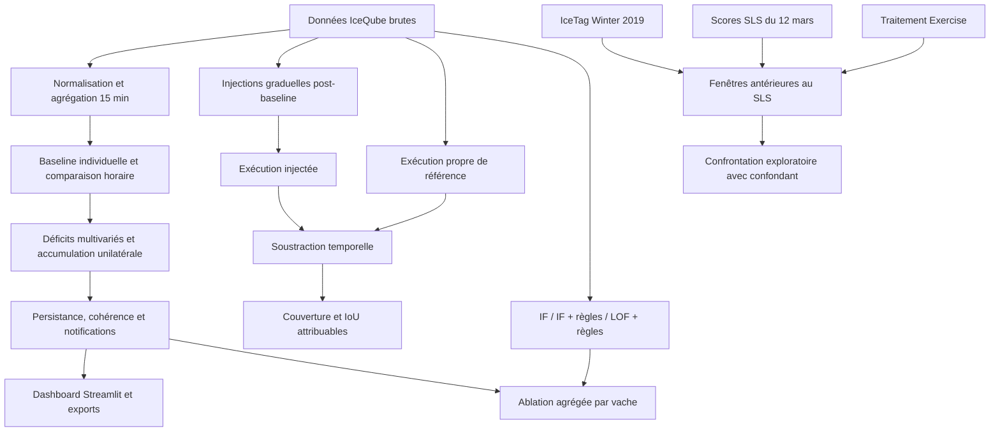

# Architecture scientifique actuelle

## Séparation des responsabilités

| Bloc | Fichiers principaux |
|---|---|
| Ingestion et variables | `core/io.py`, `core/features.py` |
| Comparateur historique | `core/model_if.py`, `core/alerts.py` |
| Détecteur principal | `core/early_warning.py` |
| Orchestration | `core/pipeline.py` |
| Benchmark | `revalidation/campaign.py` |
| Ablation | `revalidation/ablation.py` |
| Revue manuelle | `revalidation/manual_review.py` |
| Analyse SLS | `revalidation/mcgill_sync_validation.py` |
| Provenance | `revalidation/finalize_artifacts.py` |
| Interface | `app.py`, `ui/` |

Le notebook appelle ces modules; il ne contient pas la logique scientifique principale.
Les notebooks et scripts historiques restent archivés pour la traçabilité, mais ne
soutiennent pas les résultats actuels.
